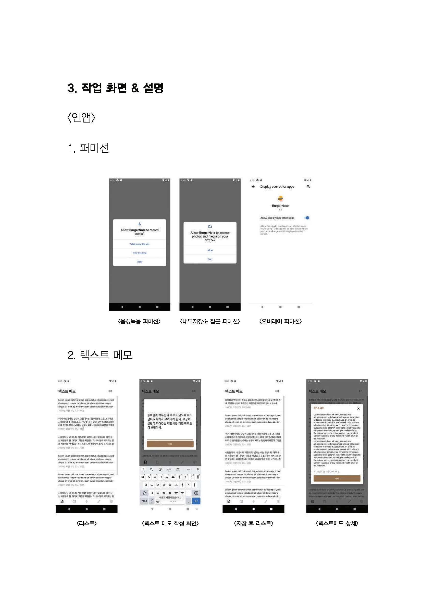
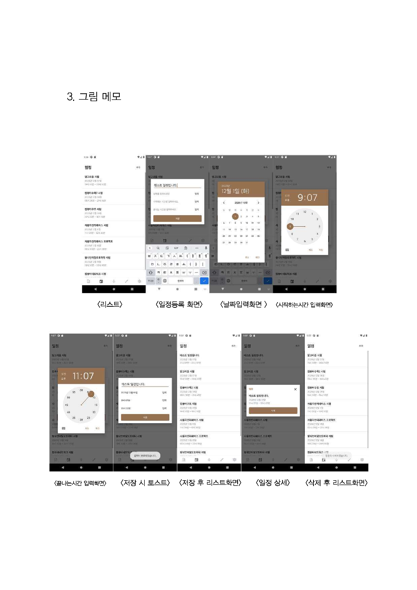
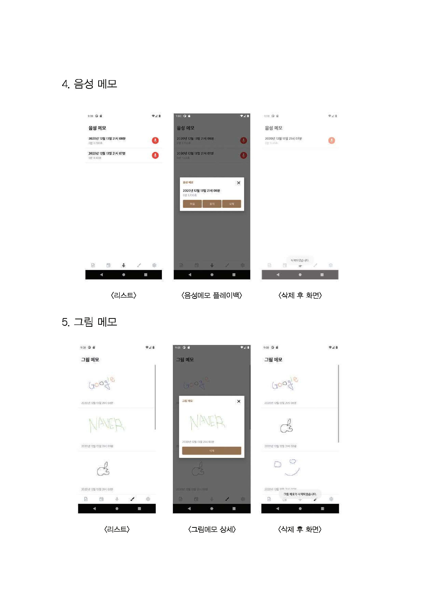
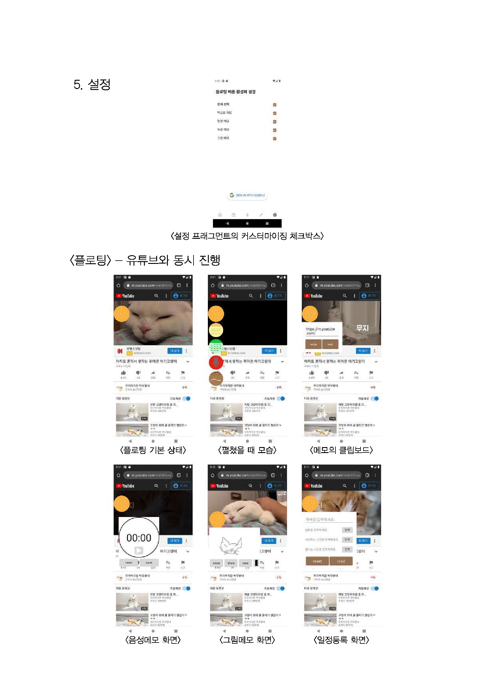
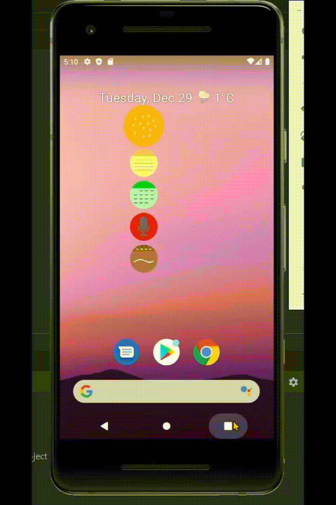
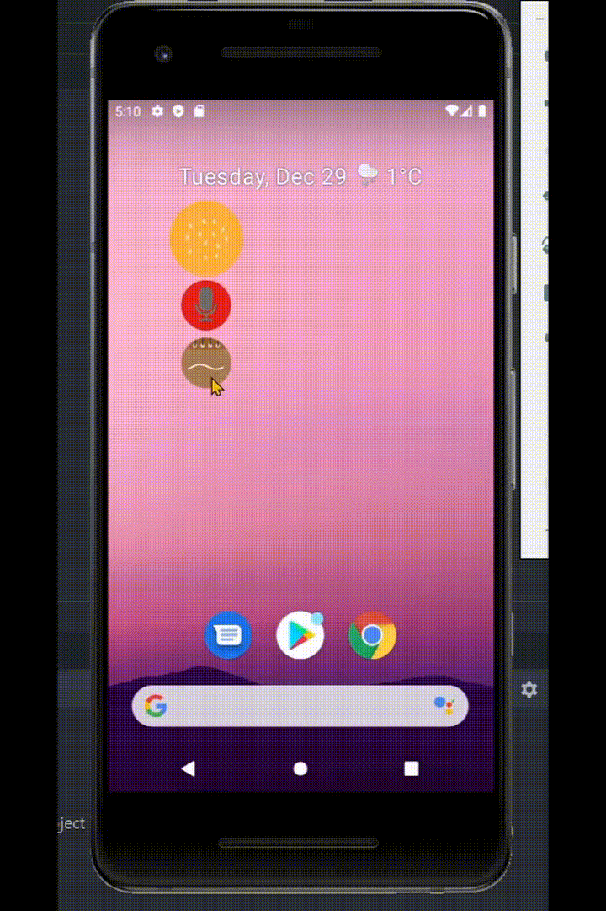

# burgerNote - project

**Soongsil University - User Interface(Android framework)**

Demo video [Youtube](https://www.youtube.com/watch?v=e-oLKmZaIK0&list=PLyaDjBUu6sYCJ955oKB0Xn2rjgjTMTx2q&index=14 "Demo video")

Plan [here](./res/plan.pdf "Plan")

Report [here](./res/report.pdf "Report")

---

## Task View & Description

|                                  |                              |                                  |                              |
| :------------------------------: | :--------------------------: | :------------------------------: | :--------------------------: |
|  |  |  |  |

&nbsp;

---

## Preview

|             Start              |              in app              |                      Floating View                       |                   Customizing floating view                   |               example - draw               |
| :----------------------------: | :------------------------------: | :------------------------------------------------------: | :-----------------------------------------------------------: | :----------------------------------------: |
|  |  |  |  |  |

&nbsp;
